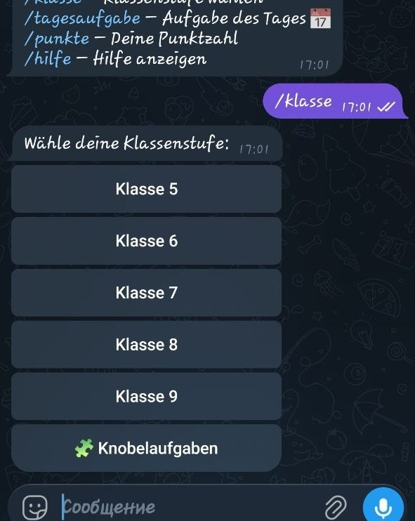
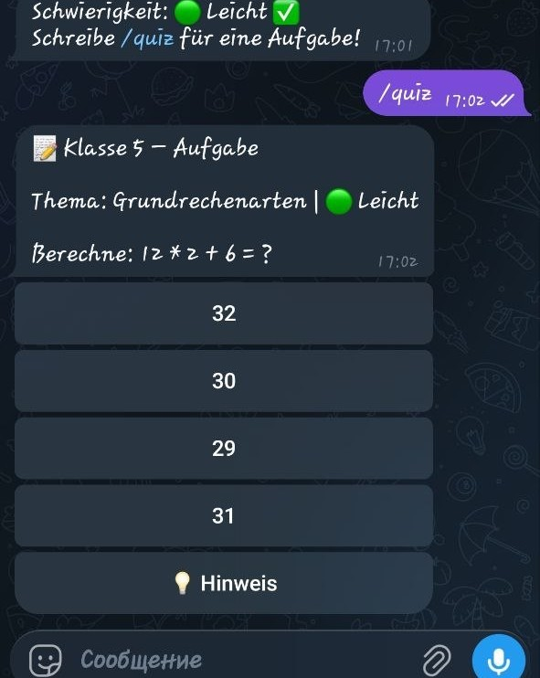
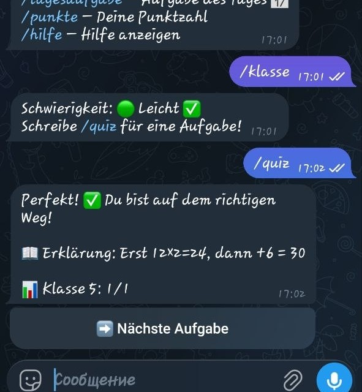

# Mathe-Quiz Telegram Bot 🎓

[](https://github.com/Alexsonya/mathe_bot/actions/workflows/deploy.yml)

Ein interaktiver Telegram-Bot zum Üben von Mathematik für die Klassenstufen 5–9 mit Knobelaufgaben, Hinweisen und Erklärungen.

> Das Projekt wurde auf Deutsch umgesetzt, um meine Sprachkenntnisse im IT-Kontext zu verbessern.

## Warum dieses Projekt?

Dieses Projekt verbindet meine Erfahrung im Bildungsbereich mit meinen Python-Kenntnissen. Der Bot generiert mathematische Aufgaben dynamisch, bietet verschiedene Schwierigkeitsstufen und gibt nach jeder Antwort eine verständliche Erklärung — so wird Lernen interaktiv und macht Spaß.

## Demo

<p align="center">
  
  
  
</p>

## Funktionen

- **Klassenstufen 5–9** — Aufgaben nach russischem Lehrplan
- **Knobelaufgaben** — Logikrätsel, Zahlenfolgen, Denkaufgaben
- **Schwierigkeitsstufen** — Leicht / Mittel / Schwer / Zufällig
- **Hinweise** — Tipp-Button bei jeder Aufgabe
- **Erklärungen** — Lösungsweg nach jeder Antwort
- **Aufgabe des Tages** — Eine tägliche Aufgabe für alle Nutzer
- **Punktestand** — Fortschritt pro Klassenstufe verfolgen
- **Verschiedene Themen** pro Klassenstufe:
  - Klasse 5: Grundrechenarten, Brüche, Dezimalzahlen, Textaufgaben
  - Klasse 6: Prozentrechnung, negative Zahlen, Verhältnisse, Gleichungen
  - Klasse 7: Potenzen, lineare Gleichungen, Geometrie (Flächen)
  - Klasse 8: Wurzeln, Satz des Pythagoras, quadratische Gleichungen, Kreisfläche
  - Klasse 9: Wahrscheinlichkeit, Zahlenfolgen, lineare Funktionen, Statistik

## Befehle

| Befehl | Beschreibung |
|---|---|
| `/start` | Startseite anzeigen |
| `/klasse` | Klassenstufe und Schwierigkeit wählen |
| `/quiz` | Neue Aufgabe bekommen |
| `/tagesaufgabe` | Aufgabe des Tages |
| `/punkte` | Punktestand anzeigen |
| `/zuruecksetzen` | Punkte zurücksetzen |
| `/hilfe` | Hilfe anzeigen |

## Installation

```bash
git clone https://github.com/Alexsonya/mathe_bot.git
cd mathe_bot
pip install -r requirements.txt
```

## Einrichtung

1. Bot-Token bei [@BotFather](https://t.me/BotFather) erstellen
2. Token in `.env` eintragen:

```bash
cp .env.example .env
# .env bearbeiten und Token einfügen
```

## Starten

```bash
python3 bot.py
```

## Projektstruktur

```
mathe_bot/
├── bot.py            — Hauptlogik und Telegram-Handler
├── math_tasks.py     — Aufgabengenerator (Klassen 5–9 + Knobel)
├── messages.py       — Deutsche UI-Texte
├── requirements.txt  — Abhängigkeiten
├── .env.example      — Token-Vorlage
├── .gitignore
└── screenshots/      — Screenshots für README
```

## Technologien

- Python 3
- python-telegram-bot (asynchrone Handler)
- Dynamische Aufgabengenerierung (keine externe Datenbank nötig)
- Hashbasierter Tages-Seed für die tägliche Aufgabe

## Was ich gelernt habe

- Arbeit mit der Telegram Bot API
- Asynchrone Handler in Python
- Strukturierung eines kleinen Python-Projekts
- Erstellung deutscher UI-Texte (B1–B2)
- Dynamische Generierung mathematischer Aufgaben

## Autorin

Sofya Iakovleva — [GitHub](https://github.com/Alexsonya)
